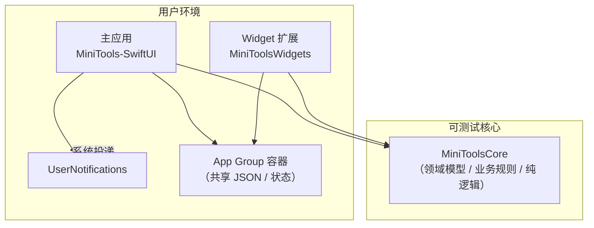

# 架构说明（Architecture）

> **放置位置**：本文件为起草稿，建议复制到 [work-plan-mac](https://github.com/ShiShanLing/work-plan-mac) 仓库**根目录**，命名为 `ARCHITECTURE.md`。  
> **读者**：维护者、Code Review、希望快速理解模块边界的贡献者。  
> **产品功能概述**：见 [README-zhihu.md](https://github.com/ShiShanLing/work-plan-mac/blob/main/README-zhihu.md)（用户向）；构建与发版：见仓库根目录 [README.md](https://github.com/ShiShanLing/work-plan-mac/blob/main/README.md)。

---

## 1. 目标与非目标

### 1.1 目标

- 在 **macOS** 上提供轻量、**本地优先** 的提醒与例行事项能力（定时提醒、重复节奏、时段内间隔提醒等）。
- 通过 **WidgetKit** 在桌面快速查看「今日 / 下次」类信息，并与主应用 **共享同一数据源**。
- 将 **可测试的核心逻辑** 收敛到 **Swift Package（MiniToolsCore）**，主应用与扩展薄封装系统 API（SwiftUI、UserNotifications、App Group 容器读写等）。

### 1.2 非目标（维护者可按需修订）

- （示例）不提供账号体系与跨设备云同步；若未来增加，应单独写 ADR 说明一致性与隐私。
- （示例）不追求「全能 GTD / 项目管理」；复杂协作、多人权限等不在当前架构假设内。

---

## 2. 系统上下文（一页图）

下列为逻辑视图；具体类型名、文件名由维护者在对应小节补链接。



**维护者补充（建议写成短句贴在图上或本节下方）**

- 主应用负责：授权引导、调度通知、写入共享存储、UI 编排。
- Widget 负责：读取共享存储、渲染 Timeline、深链回主应用（若有）。
- Core 禁止：直接 `import SwiftUI` / `import WidgetKit`（若当前未完全做到，在本节注明例外与还债计划）。

---

## 3. 仓库与 Xcode 目标

| 路径 / 目标 | 职责 |
|-------------|------|
| `MiniTools-SwiftUI.xcodeproj` | 主工程；Scheme **MiniTools-SwiftUI** 日常运行（⌘R，My Mac）。 |
| `MiniTools-SwiftUI/` | macOS 主应用源码：SwiftUI 视图、应用生命周期、与系统 API 的适配层。 |
| `MiniToolsCore/` | Swift Package：**领域模型、持久化模型、解码容错、调度/展开规则（纯逻辑优先）**；`swift test` 可跑。 |
| `MiniToolsWidgets/` | Widget Extension；与主应用共用 **App Group** 与共享模型读取逻辑。 |
| `.github/workflows/` | CI / 可选云端发版（以 README 与工作流注释为准）。 |
| `scripts/` | 本地发版、清理缓存等（见根目录 README）。 |

**依赖方向（约束）**

```text
MiniTools-SwiftUI  ──►  MiniToolsCore
MiniToolsWidgets   ──►  MiniToolsCore
MiniToolsCore      ──►  （标准库 / 允许的 Apple 框架：维护者列出白名单）
```

---

## 4. 模块边界与分层

### 4.1 建议分层（命名可与仓库实际对齐）

| 层 | 说明 | 典型内容 |
|----|------|----------|
| **Presentation** | SwiftUI / Widget UI | View、`ViewModel`/`Observable` 适配（若采用 Observation） |
| **Application** | 用例编排 | 将用户操作转为 Core 调用 + 触发 Side Effect（写文件、注册通知） |
| **Domain** | 业务规则 | 重复展开、时段内下一次触发时刻、跳过周末等 **无副作用** 函数 |
| **Infrastructure** | 桥接系统 | App Group 路径、`JSONEncoder/Decoder` 封装、`UserNotifications` 封装 |

若当前代码尚未严格分层，在本节列出 **已知耦合点** 与 **重构 backlog（Issue 链接）**。

### 4.2 App Extension 约束

- Widget Extension **生命周期短、内存紧**：避免在主线程做大解析；缓存策略与时间线刷新间隔写明（见第 7 节）。
- 与主应用 **Capability**（App Groups、Team ID）必须一致，否则共享容器读写失败；详见第 5 节。

---

## 5. App Group 与数据契约

### 5.1 标识符（以仓库为准）

- **App Group ID**：`group.com.MiniTools.www.MiniTools-SwiftUI`（见仓库内 `AppGroup.swift` / `WidgetSharedModels.swift` 等；若更名，三处同步：主应用、Extension、`MiniToolsCore` 中的常量）。
- **共享内容**：本地持久化的业务数据（如 JSON）；维护者在此列出 **文件名、顶层 Schema 版本字段（若有）**。

### 5.2 读写契约（建议明确写出来）

| 字段 | 说明 |
|------|------|
| **写入权威（Source of truth）** | 默认：**仅主应用写入**；Widget **只读**。（若 Widget 会触发深层写入，在此写明例外与并发策略。） |
| **编码** | UTF-8 JSON；日期/time zone 规则（本地日历 vs UTC）。 |
| **解码容错** | README / Releases 已提到 JSON 解码容错方向；此处列出 **缺字段默认值策略**、是否丢弃损坏条目并打点日志。 |
| **迁移** | 若尚无 Schema 版本号，注明「当前无迁移」或 Issue 链接指向迁移计划。 |

### 5.3 并发与一致性（简述）

- 主应用写入是否与 Widget 读取并发：**macOS 上使用原子写（写临时文件再 rename）或串行队列**（维护者写明当前实现）。
- Widget 读到不完整文件时的行为：**展示占位 / 上次快照 / 空状态**。

---

## 6. 通知（UserNotifications）设计

### 6.1 能力概述

- **定时提醒**：一次性、`UNCalendarNotificationTrigger` 等（维护者补具体 trigger 选型）。
- **例行任务**：按每天 / 每 N 天 / 每周 / 每月 / 每年展开为未来一段时间的本地通知请求。
- **时段提醒**：在 `[start, end]` 内按间隔触发；跨午夜规则在本节说明。

### 6.2 系统约束与产品取舍（务必写清）

- **本地通知数量上限**：系统在队列中的通知数量有限；本项目策略：**定期打开应用续排 / 合并请求 / 裁剪远端日程**（与 README-zhihu 描述对齐；此处写实现要点）。
- **权限被拒**：UI 引导跳转系统设置；数据仍本地保存。
- **用户从通知交互**：「延后」「标记完成」等与 Core 状态更新的链路（函数级别可由代码注释指向本节）。

### 6.3 调试清单（维护者/贡献者）

- [ ] 关闭通知权限时的降级路径  
- [ ] 多时区 / DST（夏令时）边界  
- [ ] 大批量例行展开的性能（是否在后台队列）

---

## 7. Widget（WidgetKit）策略

### 7.1 Timeline / Reload

- **刷新触发**：`WidgetCenter.reloadTimelines` 调用点（保存数据后、应用启动后等）。
- **Policy**：`.atEnd` / `.after(...)` / `.never` 选型理由简述。
- **展示策略**：「即将一条 / 今日摘要」的数据截取规则（与 README-zhihu 一致）。

### 7.2 深链（可选）

- 小组件点击跳转：URL scheme / `widgetURL`；参数如何映射到主应用 Tab（维护者补）。

---

## 8. 技术栈摘要

| 类别 | 选型 |
|------|------|
| UI | SwiftUI（macOS） |
| 状态（可选注明） | Observation（`@Observable` 等） |
| 本地通知 | UserNotifications |
| 小组件 | WidgetKit + App Group |
| 核心逻辑 | `MiniToolsCore` Swift Package |
| 持久化 | 本地 JSON（路径：App Group 容器内） |

---

## 9. 构建、测试与质量门禁

### 9.1 本地

```bash
# 主编译（与仓库 README 一致）
xcodebuild -scheme MiniTools-SwiftUI -project MiniTools-SwiftUI.xcodeproj -destination 'platform=macOS' build

# Core 单测
cd MiniToolsCore && swift test
```

### 9.2 CI（若启用）

- 工作流文件：`.github/workflows/*.yml`
- **门禁**：至少 `swift test`；可选 `xcodebuild build`（受 Runner macOS/Xcode 版本影响）。
- 维护者在此列出：**允许的 Xcode / macOS 版本矩阵**。

### 9.3 静态分析与格式化（可选 backlog）

- SwiftLint / 格式化脚本是否在 roadmap（Issue 链接）。

---

## 10. 安全与隐私（简述）

- 数据默认 **仅存本机**；不上传业务数据到开发者服务器（与 README-zhihu 一致）。
- 日志：**禁止**在 Release 打印敏感条目明细（标题/id 级别可自行定义）。
- App Sandbox：**目录读写范围**（若启用 Sandbox，写明 entitlement）。

---

## 11. 风险与技术债（滚动更新）

| 编号 | 描述 | 影响 | 计划 |
|------|------|------|------|
| TD-1 | （示例）Core 与 UI 仍存在耦合 | 测试覆盖面受限 | Issue # |
| TD-2 | （示例）通知队列裁剪策略待优化 | 极端多日历时边缘行为 | Issue # |

---

## 12. 变更记录（可选）

| 日期 | 摘要 |
|------|------|
| YYYY-MM-DD | 初稿：模块图、App Group、通知与 Widget 策略骨架 |

---

## 维护者待填清单（复制到 Issue 或直接补本文）

- [ ] 补：共享 JSON **文件名 + 顶层 key + schema 版本**  
- [ ] 补：**原子写**或并发策略的具体实现位置（文件/类型名）  
- [ ] 补：例行任务 **展开算法**入口（Core 中的类型/函数名）  
- [ ] 补：Widget **reload** 调用点列表  
- [ ] 补：深链 URL 与路由表（若有）  
- [ ] 在根 `README.md` 增加指向本文件的链接：**开发者架构 → ARCHITECTURE.md**
