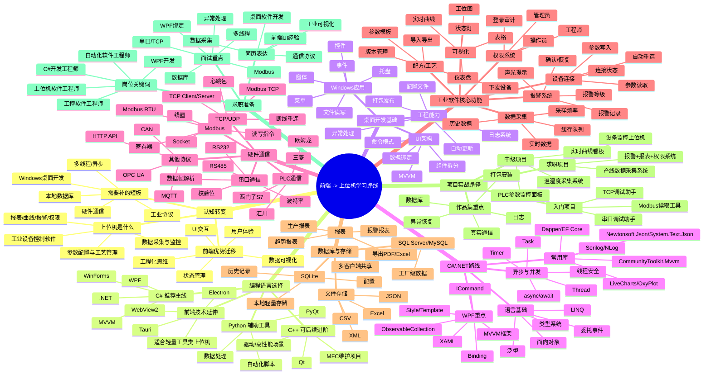

# 前端转上位机学习路线思维导图

> 目标：如果后续想从前端转向上位机/工控软件方向，可以优先走 **C# + WPF + 串口/TCP + Modbus + 数据库** 这条路线。

前端转上位机不是完全从零开始。前端已有的 UI、交互、状态管理、数据可视化、工程化能力，在上位机软件里依然有价值。真正需要补的是：硬件通信、工业协议、桌面软件开发、本地数据库、多线程和异常恢复。

## 推荐主线

**C# + WPF + Modbus/TCP/串口 + SQLite/SQL Server**

这条路线对前端出身比较友好：

- WPF 的 XAML、数据绑定、组件化、状态更新，和前端思维有相通之处。
- C# 比 C++ 更容易上手，工程体验也比较现代。
- C# / WPF / WinForms 在国内上位机岗位里仍然很常见。
- 上位机项目重视界面、数据、设备连接、稳定性，前端经验能迁移一部分。

## 阶段路线

### 第 1 阶段：C# 基础 + 桌面开发入门

目标：能写一个普通 Windows 桌面工具。

重点内容：

- C# 基础语法
- 面向对象
- 泛型、委托、事件
- LINQ
- WinForms 基础控件
- WPF 基础控件
- 文件读写、JSON 配置

练手项目：

- 本地配置管理工具
- 简单日志查看器
- CSV/Excel 数据查看工具

### 第 2 阶段：串口 + TCP 通信

目标：理解上位机和设备之间如何通信。

重点内容：

- 串口参数：COM 口、波特率、数据位、停止位、校验位
- RS232 / RS485 基础概念
- TCP Client / TCP Server
- UDP 基础
- 心跳包
- 断线重连
- 数据帧解析
- 超时、重试、异常处理

练手项目：

- 串口调试助手
- TCP 客户端/服务端调试工具
- 数据帧解析工具

### 第 3 阶段：Modbus RTU / Modbus TCP

目标：能读写常见工业设备的数据点位。

重点内容：

- Modbus RTU
- Modbus TCP
- 线圈
- 离散输入
- 保持寄存器
- 输入寄存器
- 功能码
- CRC 校验
- 点位表阅读
- 批量读写

练手项目：

- Modbus 寄存器读取工具
- Modbus 参数下发工具
- 模拟设备 + 上位机读写 Demo

### 第 4 阶段：WPF + MVVM

目标：做出结构清晰、可维护的工业监控界面。

重点内容：

- XAML
- Binding
- ICommand
- ObservableCollection
- INotifyPropertyChanged
- Style / Template
- UserControl
- MVVM 分层
- CommunityToolkit.Mvvm

练手项目：

- 实时数据监控面板
- 设备状态看板
- 参数配置页面
- 实时曲线页面

### 第 5 阶段：数据库 + 日志 + 报表

目标：补齐上位机项目常见业务能力。

重点内容：

- SQLite 本地数据库
- SQL Server / MySQL
- Dapper 或 EF Core
- Serilog / NLog
- 报警记录
- 历史数据
- 报表导出
- CSV / Excel 导入导出
- 配方和工艺参数管理

练手项目：

- 报警记录系统
- 历史曲线查询系统
- 生产报表导出工具
- 配方管理工具

### 第 6 阶段：完整求职项目

推荐项目：**设备数据采集与监控上位机**

建议包含：

- 登录和权限
- 设备连接管理
- 串口或 TCP 通信
- Modbus RTU 或 Modbus TCP
- 实时数据采集
- 实时曲线
- 设备状态灯
- 参数读取和下发
- 报警记录
- 历史数据查询
- SQLite 或 SQL Server 存储
- 日志系统
- Excel / CSV 报表导出
- 打包安装
- 断线重连和异常恢复

这个项目如果完成度高，可以作为转岗作品集的核心项目。

## 求职关键词

找岗位时可以重点搜索：

- 上位机软件工程师
- C# 开发工程师
- WPF 开发工程师
- WinForms 开发工程师
- 工控软件工程师
- 自动化软件工程师
- 设备软件工程师
- 运动控制软件工程师
- 机器视觉软件工程师

## 简历表达方向

前端经验不要丢，可以这样迁移表达：

- 有复杂业务系统 UI 开发经验，能快速构建工业监控界面。
- 熟悉状态管理、组件化和数据可视化，适合开发设备看板、实时曲线、参数配置页面。
- 具备工程化意识，能关注代码结构、异常处理、可维护性和用户操作体验。
- 正在补充 C# / WPF / 串口 / TCP / Modbus / 数据库存储能力。

## 面试重点

建议重点准备：

- 串口通信的基本参数
- TCP 和 UDP 的区别
- Modbus RTU 和 Modbus TCP 的区别
- 寄存器、线圈、功能码
- 多线程和 UI 线程更新
- WPF Binding 和 MVVM
- 数据库表设计
- 日志和异常处理
- 断线重连机制
- 如何保证数据采集稳定性

## 一句话总结

前端转上位机的关键，不是抛掉前端经验，而是把“界面 + 数据 + 交互”的能力接到真实设备和工业协议上。

